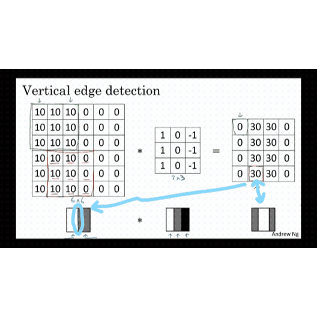
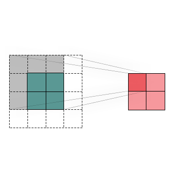

# Getting started with CNNs

## Edge Detection

The convolution operation is one of the fundamental building blocks of a convolutional neural network. Using edge detection as the motivating example, you will see how the convolution operation works.

Lets take an example. Given a picture like that for a computer to figure out what are the objects in this picture, the first thing you might do is maybe detect vertical edges in this image. For example, this image has all those vertical lines, where the buildings are, as well as kind of vertical lines idea all lines of these pedestrians and so those get detected in this vertical edge detector output. And you might also want to detect horizontal edges so for example, there is a very strong horizontal line where this railing is and that also gets detected sort of roughly here. How do you detect edges in image like this?

<caption>

Here is a simple 6 by 6 image where the left half of the image is 10 and the right half is zero. If you plot this as a picture, it might look like this, where the left half, the 10s, give you brighter pixel intensive values and the right half gives you darker pixel intensive values.

In this image, there is clearly a very strong vertical edge right down the middle of this image as it transitions from white to black or white to darker color. When you convolve this with the 3 by 3 filter and so this 3 by 3 filter can be visualized as follows, where is lighter, brighter pixels on the left and then this mid tone zeroes in the middle and then darker on the right. What you get is this matrix on the right.

## The Convolution Operation

Right now we can see how convolution can extract features efficiently from images and without using up so much vector space in contrast to using Fully Connected Networks.

And here you can see the mechanism of the Convolution Operation.

So far, the output of a single convolution of an input of a shape of (6, 6) by a filter of a shape (3, 3) will be an output of a shape (4, 4).

This relationship can be described by the function:

$$ n*{out} = n*{in} - f + 1 $$
where:

$n_{out}:$ width/height of the output

$n_{in}:$ width/height of the input

$f:$ width/height of the filter

Applying this function on the previous example:

$$ n\_{out} = 6 - 3 + 1 = 4 $$

_Correct!_

## Padding

If every time you apply a convolutional operator, your image shrinks, so you come from (6, 6) down to (4, 4), then, you can only do this a few times before your image starts getting really small, maybe it shrinks down to one by one or something. Maybe you don't want your image to shrink every time you detect edges or to set other features on it, so that's one downside.

The second downside is that, if you look the pixel at the corner or the edge, this little pixel is touched as used only in one of the outputs, because this touches that three by three region. Whereas, if you take a pixel in the middle, then there are a lot of three by three regions that overlap that pixel and so, is as if pixels on the corners or on the edges are use much less in the output. So you're throwing away a lot of the information near the edge of the image.

So, to solve both of these problems, both the shrinking output, and throwing away a lot of the information from the edges of the image, you can pad the image.

So in this case, let's say you pad the image with an additional one border, with the additional border of one pixel all around the edges. So, if you do that, then instead of a six by six image, you've now padded this to eight by eight image and if you convolve an eight by eight image with a three by three image you now get that out. Now, the four by four by the six by six image, so you managed to preserve the original input size of six by six.

$$ n*{out} = n*{in} + 2p - f + 1 $$
where:

$n_{out}:$ width/height of the output

$n_{in}:$ width/height of the input

$p:$ padding amount

$f:$ width/height of the filter

Applying this function on the previous example:

$$ n\_{out} = 6 + 2(1) - 3 + 1 = 6 $$

So by convention when you pad, you padded with zeros and p is the padding amount. So in this case, $p=1$, because we're padding all around with an extra boarder of one pixels.

So you end up with a (6, 6) image that preserves the size of the original image. So this being pixel actually influences all of these cells of the output and so this effective, maybe not by throwing away but counting less the information from the edge of the corner or the edge of the image is reduced.

_Example on a (2, 2) \* (3, 3) convolution_

## Striding

Stride convolutions is another piece of the basic building block of convolutions as using convolution neural networks. Let me show you an example.

Let's say you want to convolve this (5, 5) image with this (3, 3) filter. Note that padding = 1. Except that instead of doing the usual way, we're going to do it with a stride = 2. What that means, is you take the element wise product as usual in this upper left three by three region and then multiply and add. But then instead of stepping the gray box over by one step, we're going to step it over by two steps. We're going to make it hop over two steps like so.

## TODO

- [ ] Add Convolutions over volume
- [ ] Add One layer of convolution
- [ ] Add Simple CNN
- [ ] Add Pooling
